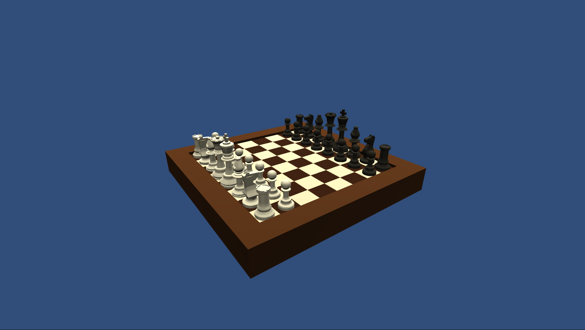

# Cosmic chess
This is a chess game in higher dimensions and with multiplayer.
The motivation for this project is from 4D chess. We wanted a good chess game in higher dimensions, so we made one. This is a truly cosmic version of chess.




## Table of contents
* [Technologies](#Technologies)
* [Platform](#Platform)
* [Server](#Server)
* [Functionalities](#Functionalities)


## Technologies
- unity v.2019.4.15f1
- C# (.NET)
- Node v.12.18.1
- uuidv4 v^6.2.6
- Websocket for node js (ws) v^7.4.2
- Our BRAIN v.gen z

## Platform
As we aim to play chess in higher dimension width friends, we will try to just make it on every platform that our friends use.
- PC windows
- MAC books
- Phones on Android and apple
- The server runs on Heroku.

## Server
To start the server
```
node server.js
```

## Functionalities 

### For now
- play chess in 2D free movement
- save the coordinates in a mathematical system (later higher dimension)


### Later
- Two or more players
- Two or more dimensions
- Save games in a database
- See possible moves in all used dimensions

